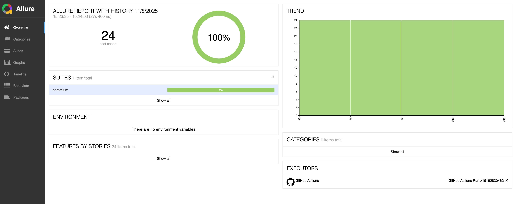
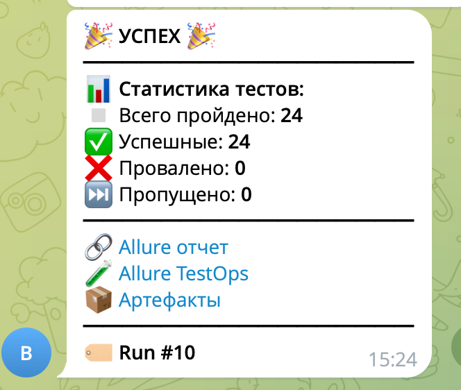

#  Дипломная работа QA.GURU | JS + Playwright | Автоматизация тестирования 4 поток

## Содержание
- [Описание](#описание)
- [Технологический стек](#технологический-стек)
- [Запуск тестов](#запуск-тестов)
- [Отчетность](#отчетность)
- [Уведомления](#уведомления)

## Описание
Дипломный проект, выполненный в рамках курса по автоматизации тестирования на JavaScript + Playwright. Проект включает UI и API тесты с интеграцией в CI/CD pipeline.

**Объекты тестирования:**
- **realworld.qa.guru** - веб-приложение для практики UI тестирования
- **apichallenges.eviltester.com** - RESTful API для отработки навыков API тестирования

## Технологический стек
Данный проект был написан на языке программирования JavaScript с использованием фреймворка Playwright. Для хранения исходного кода и запуска рабочих процессов используется облачная платформа GitHub с GitHub Actions.

Генерация отчетов о пройденных тестах формируется в Allure с отправкой отчетности в тест-менеджмент TestOps для анализа результатов и управления дефектами.

Уведомлений о статусе выполнения тестов отправляются в чат Telegram посредством бота.


## Запуск тестов

### Локальный запуск
```bash
# Клонирование репозитория
git clone from ssh git@github.com:vasyen87-cyber/apiTests.git

# Установка зависимостей
npm install

# Установка браузеров
npx playwright install --with-deps

# Запуск тестов
npm run test

# Генерация отчета
npx allure generate allure-results -o allure-report --clean
npx allure open allure-report
```
### Запуск в CI/CD
Push в main/master ветки

Pull Request в main/master

Ручной запуск через GitHub Actions

## Отчетность

### 📊 Allure Report
[Ссылка на отчёт](https://vasyen87-cyber.github.io/apiTests/)

<p text-align="center">

</p>

**Включает:**

Детальную статистику тестов

Историю запусков 

Скриншоты и видео падающих тестов

Логи выполнения

### 🔧 Allure TestOps
[Ссылка на проект](https://allure.autotests.cloud/project/4984/)

## Уведомления

### 📱 Telegram
После каждого запуска тестов приходит уведомление с результатами d xfn ,jn
<p text-align="center">

</p>